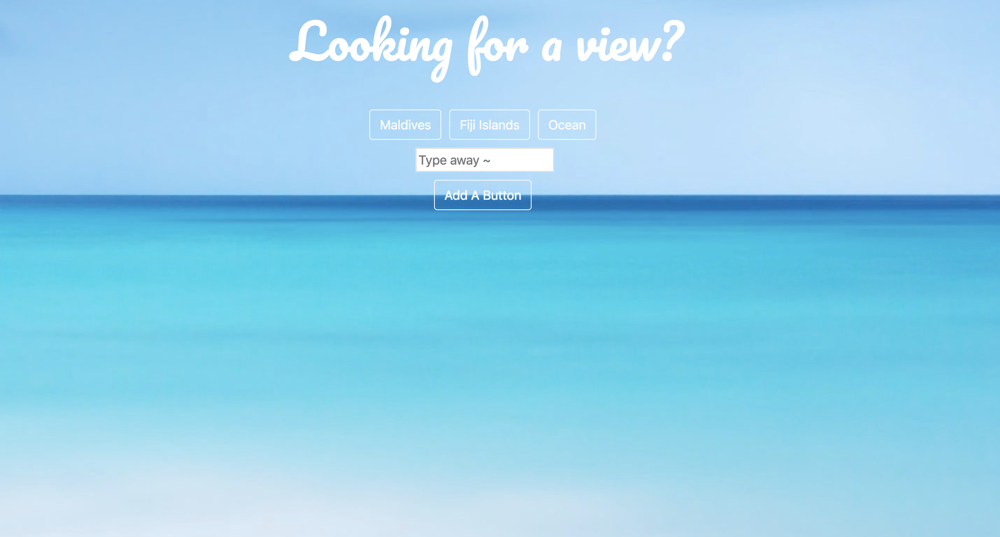
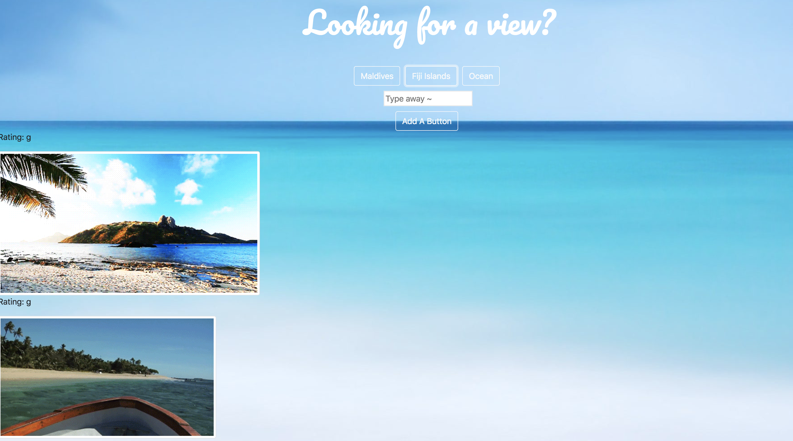

# Giftastic

In Giftastic the user will have the ability to click and view a gif based on contents of a button.

## Getting Started

User will begin on a screen that shows different buttons, once a button is clicked the contents of said button will be shown in form of a gif. If user wishes to see a different option, they will have the ability to type in a subject and create a new button for it. Once a button is clicked all results for the subject will be displayed. Gif animation can be provoked by clicking a gif of choice.




### Want a Sneak Peak of the code? Well here you have it! 

Here we are animating the gif when clicked. We have set a variable to "state" which contains the images' state and whether it will be "still" or animated. When an image is clicked it will then have a state set to animate it, and become a gif.

```
       $(".img").on("click", function () {
        var state = $(this).attr('data-state');
        if (state === 'still') {
          $(this).attr('src', $(this).attr('data-animate'));
          $(this).attr('data-state', 'animate');
        }

        else {

          $(this).attr('src', $(this).attr('data-still'));
          $(this).attr('data-state', 'still');
        };
      });
    });

```


## Deployment

Check out the game here: [Giftastic](https://delgador28.github.io/Giftastic/) - Happy Playing!


## Made With

* HTML
* CSS 
* Bootstrap
* Javascript
* jQuery
* API


Thanks for checking out my work! Want to see all of it? Click [Here](https://github.com/Delgador28?tab=repositories)!